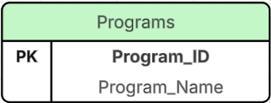
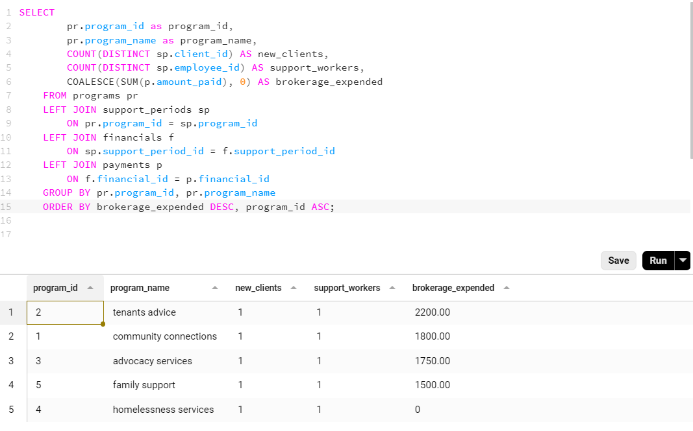
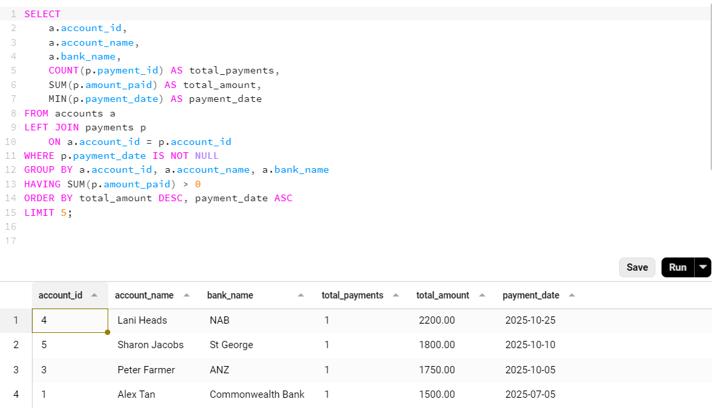
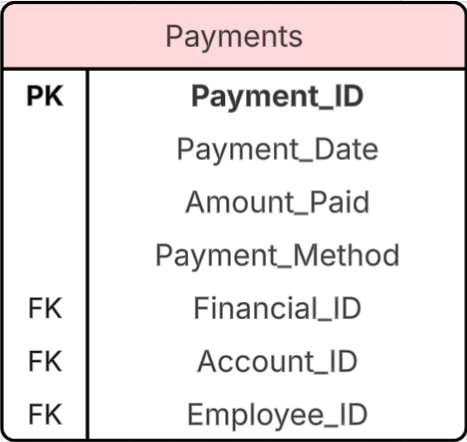

# 💻📂 Customer Relationship Management (CRM) Database 👨‍👩‍👧‍👦

> This database is required for the use of a Customer Relationship Management system for a not-for-profit organisation. The CRM records Programs, Clients, Support Periods, Financials and the resources required to provide these supports to the community.

## Prerequisites

- **PostgreSQL** (v14 or later recommended)
- **Beekeeper Studio** (optional, for GUI database management)
- Command-line access
- Basic understanding of SQL

## Database Setup

1. **Create the database**:

```sql
CREATE DATABASE crm_database;
```

2.**Connect to the database**:

```sql
psql -U postgres -d crm_database
```

or

```sql
\c
```

3.**Create the `programs` table**:



```SQL
-- Drop the table if it already exists 
DROP TABLE IF EXISTS programs;  
-- Create the table 
CREATE TABLE programs (
    program_id SERIAL PRIMARY KEY,
    program_name VARCHAR(50) NOT NULL UNIQUE,
    created_at TIMESTAMP DEFAULT CURRENT_TIMESTAMP,
    updated_at TIMESTAMP DEFAULT CURRENT_TIMESTAMP
    );
```

_Repeat process for all required tables - consult the script file where required_


4.**Insert Sample Data**:

```SQL
INSERT INTO employees (employee_name, employee_email, employee_department)
VALUES
  ('Alice Johnson', 'alice.johnson@example.com', 'Finance'),
  ('Bob Smith', 'bob.smith@example.com', 'Support Services'),
  ('Clara Lee', 'clara.lee@example.com', 'Finance');
```

## Basic Queries

1. **View all Employees records:**

```sql
SELECT * FROM employees;
```

```SQL
SELECT employee_id, employee_name
FROM employees;
```

2.**Update a Client Record:**

```SQL
UPDATE clients
SET client_dob = '1991-02-08'
WHERE client_id = '1';
```

3.**Delete a Program record:**

```SQL
DELETE FROM programs
WHERE program_name = 'Family Support';
```

## Complex Queries

**Using Beekeeper Studio (or your chosen GUI) - You can now run complex queries and view the output**

1. **Example: Data for reporting on a program's client numbers and brokerage expended:**



2.**Example data for reporting on the top 5 accounts by total amount paid, earliest payment date (excluding NULL values)**



## Example Table Schema

---

```markdown
 ## Payments Table Schema

| Column          | Type                     | Nullable | Keys               |
|-----------------|--------------------------|----------|--------------------|
| payment_id      | SERIAL / INT             | NO       | PRIMARY KEY        |
| employee_id     | INT                      | NO       | FOREIGN KEY        |
| financial_id    | INT                      | NO       | FOREIGN KEY        |
| account_id      | INT                      | NO       | FOREIGN KEY        |
| payment_date    | DATE                     | NO       |                    |
| amount_paid     | NUMERIC(10,2)            | NO       |                    |
| payment_method  | VARCHAR(50)              | NO       |                    |
| created_at      | TIMESTAMP                | YES      |                    |
| updated_at      | TIMESTAMP                | YES      |                    |

```



## Troubleshooting

**Common Errors:**

- **Error:** `syntax error at or near ")"`  
  **Cause:** You might have a trailing comma in your `CREATE TABLE` statement.  
  **Fix:** Remove the extra comma after the last column.

- **Error:** `relation "employees" does not exist`  
  **Cause:** You tried inserting or querying before creating the table.  
  **Fix:** Make sure you run the `CREATE TABLE` command first.

- **Error:** `duplicate key value violates unique constraint`  
  **Cause:** You tried to insert an employee with the same email or full-name.  
  **Fix:** Use a unique value or update the existing record. If you would like to start fresh for the table: `DROP TABLE IF EXISTS table_name;`

## Future Improvements

- Add an `employees_audit` table to track changes
- Include more sample data for testing

## Summary

This README guides you through:

- Creating a database
- Building a `programs` table
- Inserting and managing data
- Running basic SQL queries
- Providing an example of a Schema
- Basic troubleshooting

## Author

Developed by ✨BeeGeeEss ✨
