# 💻📂 Customer Relationship Management (CRM) Database 👨‍👩‍👧‍👦 - Documentation

DEV002 - Assignment 2 - Relational Database Scripts
 Submitted: 09/09/2025 
Student Number: 16183

## Introduction

> This database is required for the use of a Customer Relationship Management (CRM) system for a not-for-profit organisation.

The organisation is funded to provide multiple programs. State funding requires reporting of Key Performance Indicators (KPIs), which is reported per Support Period. Reporting on 'Brokerage Expended' is also required.

## Entity Relationship Diagram

> The database consists of 8 tables: Programs, Employees, Clients, Accounts, Support Periods, Financials, Payments, and Reconciliations. Payments acts as a junction table linking Financials and Accounts.

## Entity Relationships

| Relationship                 | Type     | Description                                   |
|-------------------------------|---------|-----------------------------------------------|
| Programs → Support_Periods    | 1:N     | One program has many support periods          |
| Clients → Support_Periods     | 1:N     | A client may have multiple support periods    |
| Clients → Financials          | 1:N     | A client can have many financials             |
| Employees → Support Periods   | 1:N     | One employee has multiple support periods open|
| Employees → Reconciliations   | 1:N     | One employee reconciles many account balances |
| Support Periods → Financials  | 1:N     | One support period captures many financials   |
| Financials → Payments         | 1:N     | One invoice can be paid by multiple payments  |
| Accounts → Payments           | 1:N     | One account can process many payments         |
| Payments                      | Junction| Connects financials and accounts              |
| Accounts → Reconciliation     | 1:N     | Many accounts can be reconciled in one process|

## Flowchart for Entity Relationships and Attributes

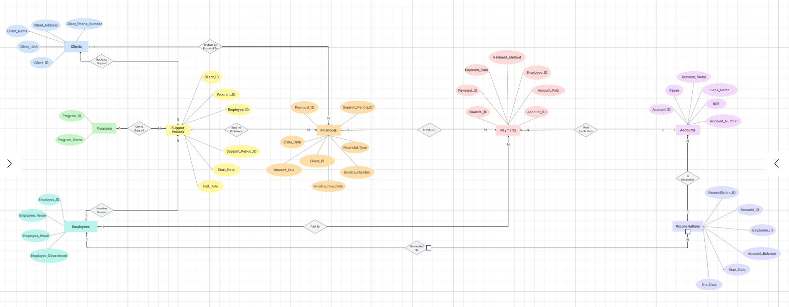

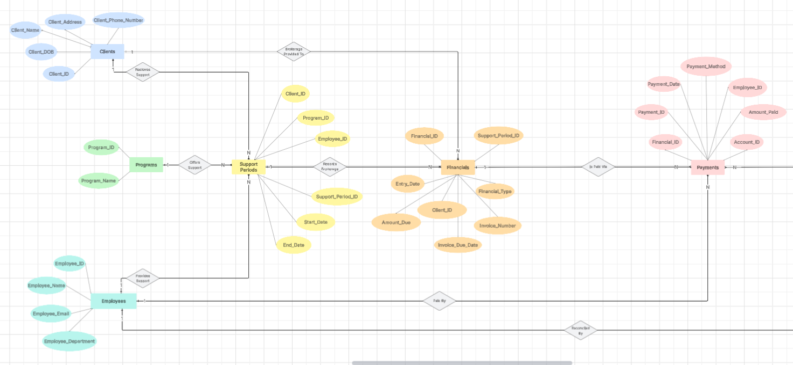

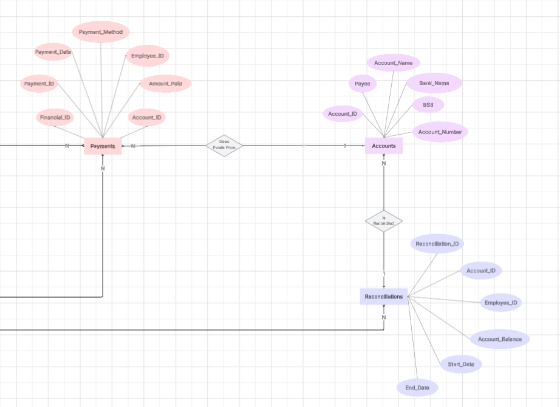

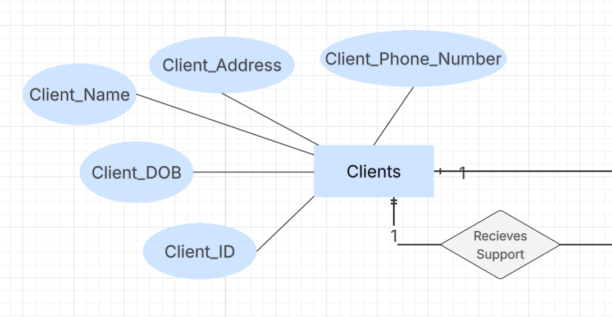

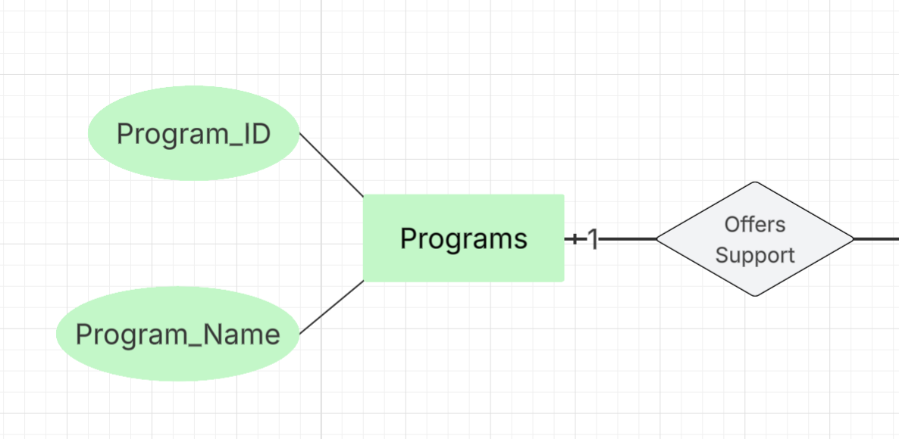

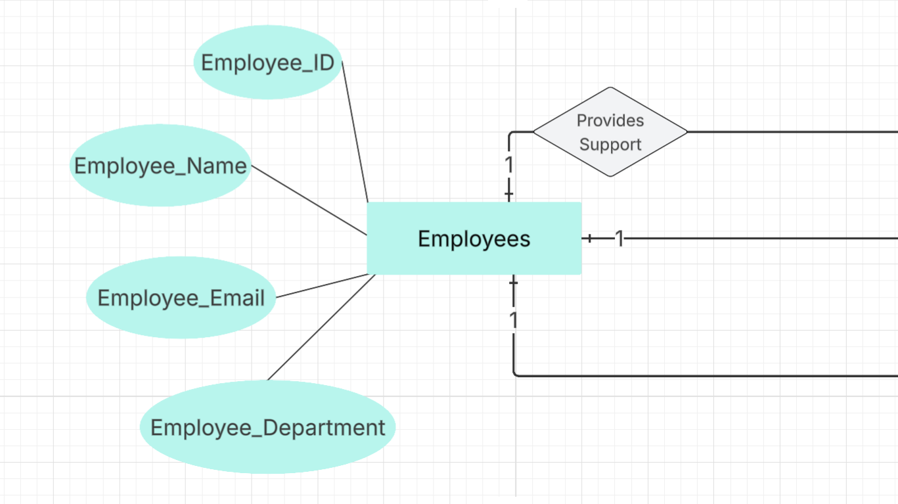

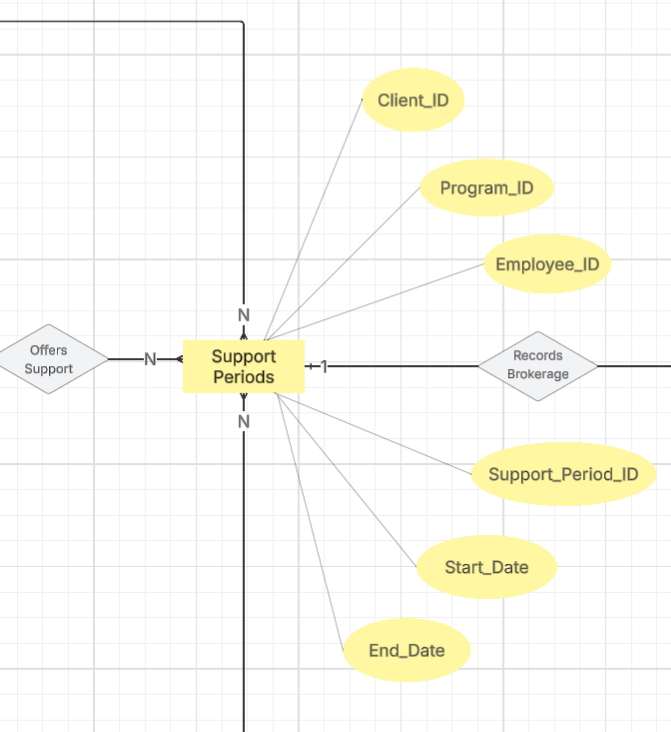

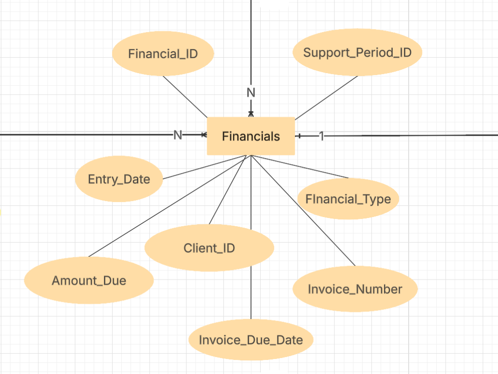

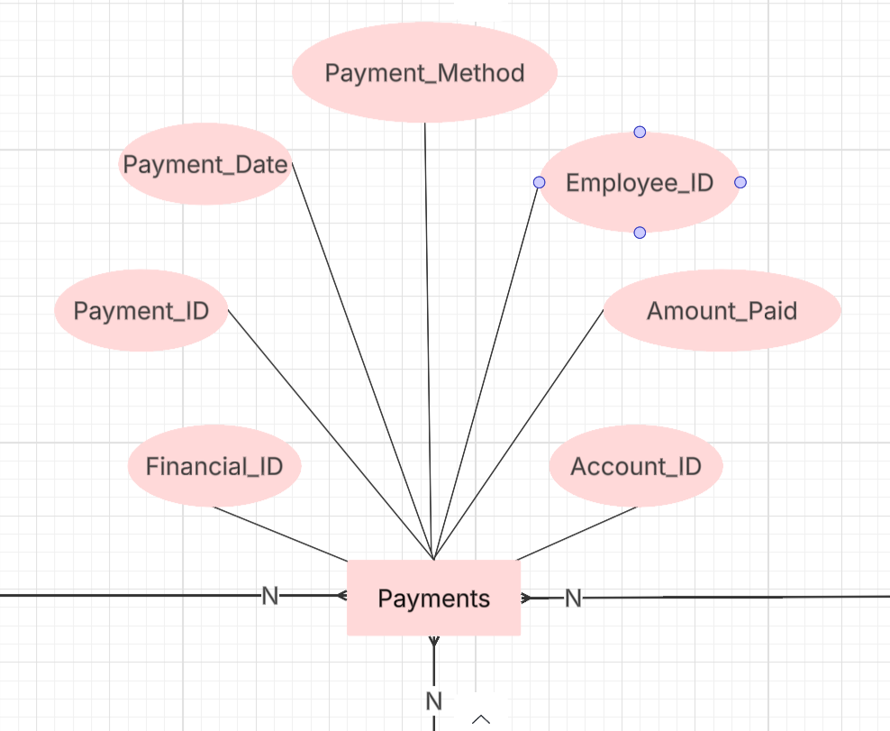

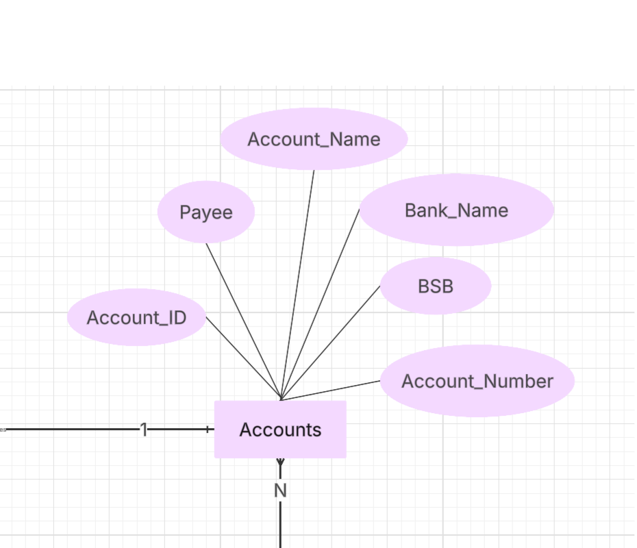

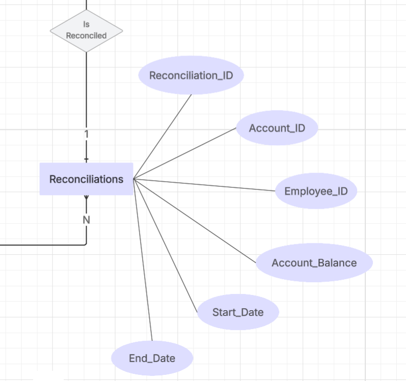

## Normalising Data
