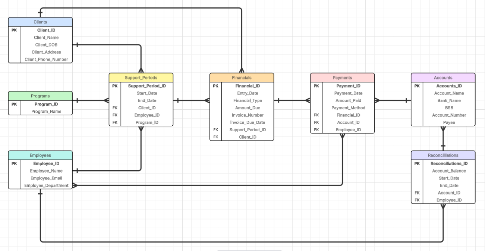

# 💻📂 Customer Relationship Management (CRM) Database 👨‍👩‍👧‍👦 - Documentation

DEV002 - Assignment 2 - Relational Database Scripts
 Submitted: 09/09/2025 
Student Number: 16183

## Introduction

> The database is required for the use of a Customer Relationship Management (CRM) system for a not-for-profit organisation.

The organisation is funded to provide multiple programs. This state funding requires reporting of Key Performance Indicators (KPIs), which in the case of these programs is reported per Support Period. Reporting is also required to capture 'Brokerage Expended'.

## Normalising Data

## Rules Regarding Relationships

* One client can have many Support Periods
* There are many Programs, however each Program can only have one Support Period open, per Client, at any given time
* One Employee can have many open Support Periods across multiple Clients
* One client can have many Financial entries showing brokerage that has been provided to them
* One Support Period will show many financials provided, per Client
* Many Financials will contain the details of many Payments
* Many Payments are paid using many Accounts
* Many Employees enter many Payments
* Many Accounts are reconciled once per Reconciliation
* One Employee completes many Reconciliations

_Please see below, reflected in the Entity Relationship Diagram (ERD:)_

